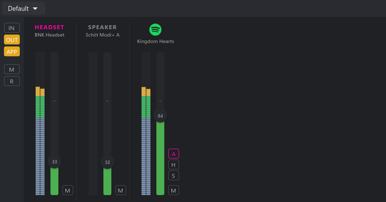

# BNK Sound

A native audio mixer for Wayland, with per-app volume and savable profiles.

_Disclaimer: personal project, built mainly for my own use, partly AI-assisted._



## Requirements

- A Linux desktop running a **Wayland** session
- **PipeWire** 0.3+ running as the audio server
- **GTK4** runtime libraries

## Install

```sh
curl -fsSL https://raw.githubusercontent.com/borgenk/bnksound/main/install.sh | sh
```

This drops the binary in `~/.local/bin` and installs the desktop entry and icon.

## Configuration

State lives under the XDG config dir (`$XDG_CONFIG_HOME/bnksound`, falling back
to `~/.config/bnksound`):

- `state.bin` - saved profiles and the active selection
- `settings.conf` - visual toggles
